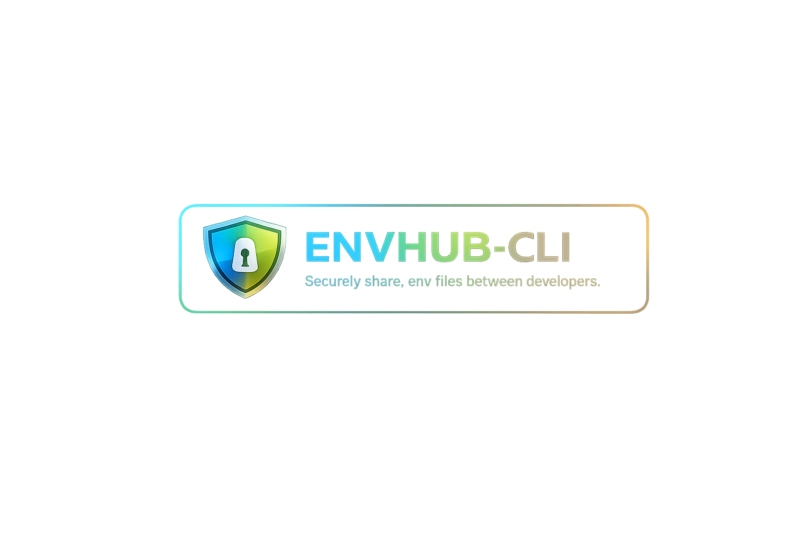

# ENVHUB-CLI



**envhub** is a CLI tool that makes sharing `.env` files between developers easy and secure. Instead of sending secrets over chat messages, envhub stores them in a cloud secrets manager and lets your team push and pull environment configurations safely.

## Why envhub?

- No more sending API keys over Teams or Slack
- Built-in version control prevents accidental overwrites
- Easy interactive setup — no manual config files needed
- Extensible provider architecture (AWS today, Azure & GCP coming soon)

## Table of Contents

### Getting Started

1. [Installation](docs/getting-started/installation.md)
2. [Setup (envhub init)](docs/getting-started/setup.md)
3. [Your First Secret](docs/getting-started/first-secret.md)
4. [Version Control](docs/getting-started/version-control.md)

### Commands

| Command | Description |
| --- | --- |
| [push](docs/commands/push.md) | Push a local .env file to the cloud |
| [pull](docs/commands/pull.md) | Pull the latest .env file from the cloud |
| [cat](docs/commands/cat.md) | Display the contents of a secret |
| [list](docs/commands/list.md) | List all managed secrets |
| [delete](docs/commands/delete.md) | Delete a secret |
| [grant](docs/commands/grant.md) | Grant a user access to a secret |
| [revoke](docs/commands/revoke.md) | Revoke a user's access to a secret |

### Architecture

- [Configuration (.envhubrc.json)](docs/architecture/configuration.md)
- [Provider Architecture](docs/architecture/providers.md)

## Quick Example

```bash
# 1. Set up your project
npx envhub init

# 2. Push your .env file
npx envhub push my-app-dev ./.env -m "Initial setup"

# 3. Your teammate pulls it
npx envhub pull my-app-dev ./.env

# 4. Grant access to another developer
npx envhub grant my-app-dev jane.doe
```

## Supported Providers

| Provider | Status |
| --- | --- |
| AWS Secrets Manager | Available |
| Azure Key Vault | Planned |
| GCP Secret Manager | Planned |
