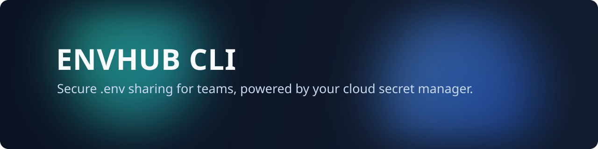

<div align="center">
  
  <br />
  <br />
  <p>
    <a href="https://www.npmjs.com/package/envhub-cli"></a>
    <a href="https://github.com/caanyp24/envhub-cli"></a>
    
  </p>
</div>

`envhub` is a developer-first CLI to push and pull environment files through AWS Secrets Manager, Azure Key Vault, or GCP Secret Manager with safer team collaboration and built-in versioning.

## Why ENVHUB

- Stop sharing secrets in Slack, Teams, or email
- Sync `.env` files with simple `push` and `pull` commands
- Reduce accidental overwrites with version tracking
- Set up projects fast with an interactive `init` wizard
- Keep full control by using your existing cloud provider

## Table of Contents

- [Quick Start](#quick-start)
- [Command Overview](#command-overview)
- [Documentation](#documentation)
- [Supported Providers](#supported-providers)
- [Requirements](#requirements)
- [License](#license)

## Quick Start

### 1. Install

```bash
npm install --save-dev envhub-cli
```

Or install globally:

```bash
npm install -g envhub-cli
```

### 2. Initialize project

```bash
npx envhub init
```

### 3. Push your current environment

```bash
npx envhub push my-app-dev ./.env -m "Initial setup"
```

### 4. Teammate pulls the same env

```bash
npx envhub pull my-app-dev ./.env
```

## Command Overview

| Command | What it does |
| --- | --- |
| [`init`](./docs/getting-started/setup.md) | Interactive setup for provider + project config |
| [`push`](./docs/commands/push.md) | Upload local `.env` to your cloud secret store |
| [`pull`](./docs/commands/pull.md) | Download latest secret and write local `.env` |
| [`cat`](./docs/commands/cat.md) | Inspect a secret’s content |
| [`list`](./docs/commands/list.md) | See all envhub-managed secrets |
| [`delete`](./docs/commands/delete.md) | Remove a secret |
| [`grant`](./docs/commands/grant.md) | Grant user access (AWS only) |
| [`revoke`](./docs/commands/revoke.md) | Revoke user access (AWS only) |
| [`doctor`](./docs/commands/doctor.md) | Validate setup and provider access |

## Common Workflow

```bash
# Initialize once per project
npx envhub init

# Push local changes
npx envhub push my-app-dev ./.env -m "Updated API keys"

# Teammates pull the latest config
npx envhub pull my-app-dev ./.env
```

## Documentation

### Getting Started

1. [Installation](./docs/getting-started/installation.md)
2. [Setup (`envhub init`)](./docs/getting-started/setup.md)
3. [First Secret](./docs/getting-started/first-secret.md)
4. [Version Control](./docs/getting-started/version-control.md)

### Architecture

- [Configuration (`.envhubrc.json`)](./docs/architecture/configuration.md)
- [Provider Architecture](./docs/architecture/providers.md)

## Supported Providers

| Provider | Status |
| --- | --- |
| AWS Secrets Manager | Available |
| Azure Key Vault | Available |
| GCP Secret Manager | Available |

## Requirements

- Node.js >= 18
- One configured provider account/CLI:
  - AWS CLI for AWS Secrets Manager
  - Azure CLI for Azure Key Vault
  - Google Cloud CLI for GCP Secret Manager

## License

MIT
